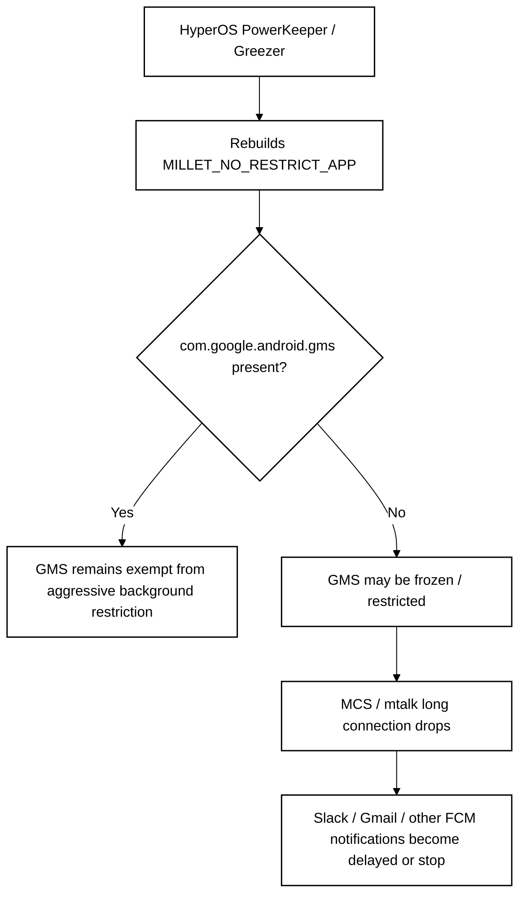
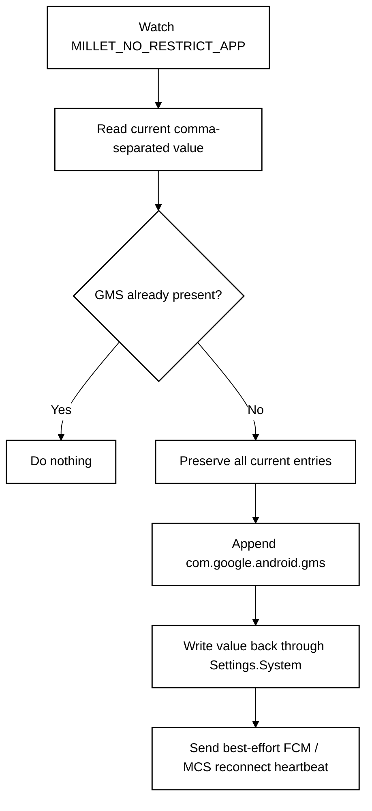
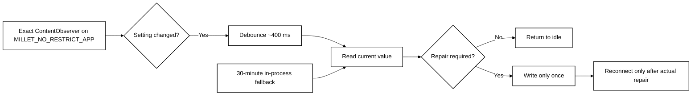
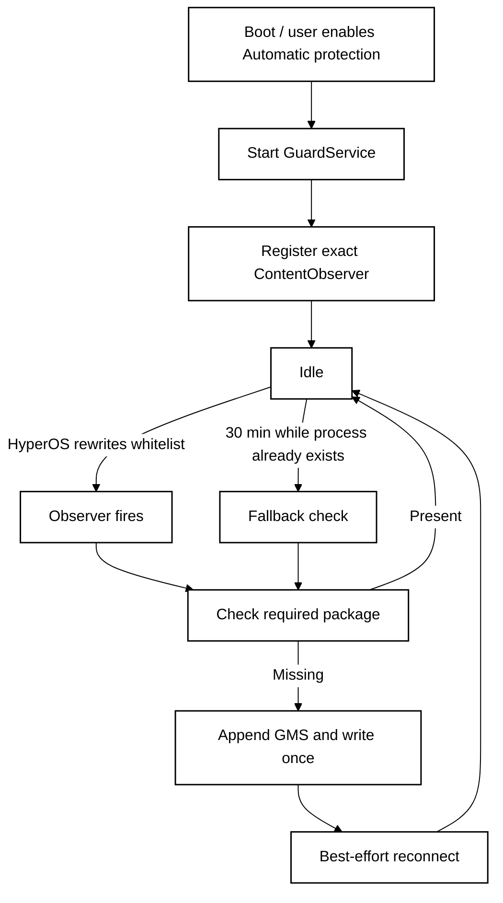

<p align="center">
  <a href="README.md"><strong>English</strong></a> · <a href="README.zh-CN.md">简体中文</a>
</p>

<p align="center">
  
</p>

# FCM Guard for HyperOS

**A lightweight no-root watchdog that keeps Google Play services in HyperOS 3's no-restrict background list so FCM push notifications stay reliable.**

**Designed for:** China-market Xiaomi / Redmi / POCO phones running **HyperOS 3 China ROM**, with Google Play services already installed and working.

## Highlights

- **No root or Shizuku** — uses the user-grantable **Modify system settings** permission instead of root, ADB, Accessibility, VPN, overlay, or device-admin privileges.
- **Finance-app friendly** — avoids Shizuku, persistent ADB/debugging, and other high-privilege no-root methods; in our testing, those approaches could still trigger remote-access or security controls in DBS, Standard Chartered, and BOC, including access blocks or account-risk actions.
- **Low background power** — event-driven monitoring is the primary path; the 30-minute fallback does not deliberately wake a sleeping phone.
- **Reconnects only when needed** — FCM/MCS heartbeat broadcasts are sent only after a real repair or when manually requested.
- **Optional persistent notification** — foreground mode is available for maximum survival reliability, while quiet background mode keeps the notification shade clean.
- **Bilingual UI** — follows the system language by default and supports English / 简体中文 switching.

## Quick setup

1. Install the latest APK from **Actions → Build APK → `FCMGuard-debug-apk`**.
2. Open **FCM Guard** and grant **Modify system settings**.
3. Tap **Repair now** once.
4. Enable **Automatic protection**.
5. In HyperOS, enable **Autostart** for FCM Guard and set its battery policy to **No restrictions**.
6. Keep **Persistent notification** enabled if maximum survival reliability matters; disable it if you prefer quiet background mode.
7. For banking-app compatibility, keep Developer options / USB debugging / Wireless debugging off unless you explicitly need them.

> FCM Guard is intended for China-ROM HyperOS 3 devices where Google services work normally but PowerKeeper / Greezer background management can still interrupt FCM delivery. Global ROMs usually do not need this workaround.

---

# Technical overview

## The underlying problem

On affected HyperOS 3 China-ROM devices, Xiaomi's PowerKeeper / Greezer background manager may rebuild the private system setting:

```text
Settings.System.MILLET_NO_RESTRICT_APP
```

When `com.google.android.gms` is missing from that comma-separated list, Google Play services can be treated like an ordinary background process. After screen-off or idle periods, HyperOS may freeze or restrict it, which can break the long-lived FCM/MCS connection to Google's push servers.



## What FCM Guard changes

FCM Guard does not replace Xiaomi's list and does not maintain its own fixed whitelist. It reads the current HyperOS value, preserves every existing package, and appends Google Play services only when necessary.



That distinction matters because PowerKeeper remains the owner of the list. FCM Guard only repairs the missing entry instead of overwriting Xiaomi's current state.

## Why `targetSdk 22`?

Modern Android versions restrict writes to non-public `Settings.System` keys even when the user grants **Modify system settings**. Xiaomi's `MILLET_NO_RESTRICT_APP` is a vendor-private key, so a normal modern-target app can be rejected by `SettingsProvider`.

FCM Guard therefore deliberately uses:

```text
compileSdk 35
targetSdk 22
```

The modern compile SDK allows current Android tooling, while the legacy target keeps the compatibility path required to write this Xiaomi setting without root, Shizuku, or shell-level privileges.

Because legacy-target apps can otherwise be letterboxed on modern tall displays, the manifest explicitly opts into resizable / tall-screen layouts.

## Low-power background design

Early prototypes checked the setting every 30 seconds and sent reconnect broadcasts too often. The current design is event-driven and normally stays idle.



### Power optimizations

- **Exact URI observer:** listens only to `Settings.System.getUriFor(MILLET_NO_RESTRICT_APP)` instead of the entire System settings table.
- **No rapid polling:** the fallback interval is 30 minutes rather than 30 seconds.
- **No deliberate wake-up:** the fallback uses an in-process `Handler`, not `AlarmManager`, WakeLock, or a repeating exact alarm, so it does not intentionally wake a sleeping device.
- **No redundant writes:** if Google Play services is already present, FCM Guard leaves the setting untouched.
- **No redundant reconnects:** heartbeat/reconnect broadcasts are sent only after an actual repair or a manual **Wake FCM now** action.
- **Optional foreground mode:** persistent notification mode improves process survival; quiet mode removes the notification but gives HyperOS more freedom to terminate the service.

## Runtime flow



## Permissions and privacy

FCM Guard uses only the minimum Android capabilities needed for this workaround:

- `WRITE_SETTINGS` — granted explicitly by the user through Android's **Modify system settings** screen.
- `RECEIVE_BOOT_COMPLETED` — restarts protection after reboot when automatic protection is enabled.
- `FOREGROUND_SERVICE` / notification support — used only when persistent-notification mode is selected.

It does **not** require root, Shizuku, persistent ADB, Accessibility, VPN, screen overlay, device-admin, account access, or network traffic inspection.

## Limitations

This project depends on Xiaomi's current HyperOS implementation. If Xiaomi changes PowerKeeper / Greezer behavior, the setting name, or the policy around Google Play services, the workaround may need to change.

The reconnect broadcast is best-effort: Android does not expose a public API that guarantees a forced FCM reconnect from a third-party app.

## References & Acknowledgements

The core HyperOS / FCM mechanism behind this project — especially the PowerKeeper / Greezer behavior and the `MILLET_NO_RESTRICT_APP` repair strategy — was originally investigated and documented by **HyperOS FCM Fix**:

- **HyperOS FCM Fix** by `dingwen07`: https://github.com/dingwen07/hyperos-fcm-fix
- Technical investigation: https://github.com/dingwen07/hyperos-fcm-fix/blob/main/docs/xiaomi-hyperos-gms-fcm-greezer-investigation.md

FCM Guard is an independent implementation with a different design goal: no Shizuku/root dependency, minimal privileges, event-driven monitoring, and lower idle background activity. No source code from HyperOS FCM Fix is copied into this repository.

Special thanks to the original author for publishing the mechanism, investigation notes, and reproducible findings that made this lightweight implementation possible.

## Build

GitHub Actions builds a signed debug APK for every push to `main`.

Open **Actions → Build APK** and download the `FCMGuard-debug-apk` artifact. The workflow reuses a stable signing key cache so repository builds can update one another without signature conflicts.

## Disclaimer

FCM Guard modifies a vendor-specific Android system setting related to HyperOS background restrictions. It is provided as-is; use it at your own risk.

## License

MIT License — see [LICENSE](LICENSE).
