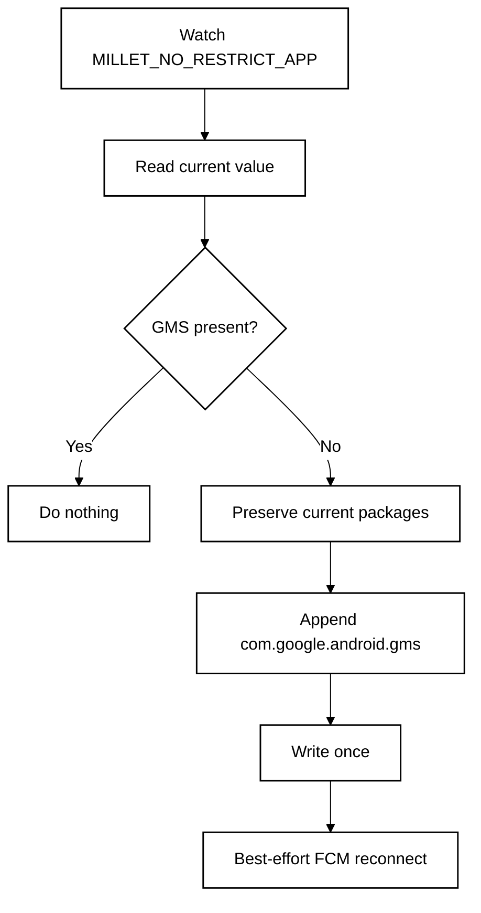

<p align="center">
  <a href="README.md"><strong>English</strong></a> · <a href="README.zh-CN.md">简体中文</a>
</p>

<p align="center">
  
</p>

# FCM Guard for HyperOS

**A lightweight, no-root watchdog for HyperOS 3 China ROM that keeps Google Play services in Xiaomi's no-restrict background list so FCM push stays reliable.**

**Designed for:** China-market Xiaomi / Redmi / POCO phones with Google Play services already installed and working.

<p align="center">
  <a href="https://github.com/ReedGAOOO/FCMGuard-HyperOS/releases/latest/download/FCMGuard-HyperOS.apk"><strong>Download latest APK</strong></a>
  ·
  <a href="https://github.com/ReedGAOOO/FCMGuard-HyperOS/releases/latest">Latest release</a>
</p>

## Highlights

- **No root or Shizuku** — uses the user-grantable **Modify system settings** permission instead of root, persistent ADB, Accessibility, VPN, overlay, or device-admin privileges.
- **Finance-app friendly** — keeps the implementation deliberately low-privilege for better compatibility with security-sensitive apps.
- **Low background power** — exact event-driven monitoring is the main path; the 30-minute fallback is in-process and does not deliberately wake a sleeping phone.
- **Reconnects only when needed** — FCM/MCS reconnect broadcasts are sent only after a real whitelist repair or a manual request.
- **Optional persistent notification** — foreground mode uses a visible-but-silent notification channel for stronger process survival; quiet background mode remains available.
- **FCM app assistant** — scans installed user apps for standard Firebase/GCM manifest signals and links to HyperOS autostart management plus per-app settings.
- **Native dark mode** — System / Light / Dark, with **System** as the default.
- **10-language UI** — English, Simplified Chinese, Traditional Chinese, French, Japanese, Korean, Spanish, Portuguese, German, and Russian through Android's native per-app language mechanism.
- **Compact-phone ready** — responsive layout checks cover 320–480dp widths, including a Xiaomi 17-class 393dp profile.

## Quick setup

1. Install the latest APK from **GitHub Releases**.
2. Open FCM Guard and grant **Modify system settings**.
3. Tap **Repair now** once.
4. Enable **Automatic protection**.
5. In HyperOS, enable **Autostart** for FCM Guard and set battery policy to **No restrictions**.
6. Keep **Persistent notification** enabled for maximum survival reliability. If Android/HyperOS blocks notifications for FCM Guard, the app opens the system notification settings so the foreground notification can be enabled.
7. Optional: scan **FCM apps** and configure likely FCM clients in HyperOS autostart/per-app settings.
8. Optional: tap **Open FCM diagnostics** to open Google Play services diagnostics and inspect the `mtalk.google.com:5228` connection.

> FCM Guard is mainly for China-ROM HyperOS 3 devices where Google services work normally but PowerKeeper / Greezer can still interrupt the background FCM connection.

---

# Technical overview

## Core mechanism

Affected HyperOS builds can rebuild the private setting:

```text
Settings.System.MILLET_NO_RESTRICT_APP
```

If `com.google.android.gms` is removed, Google Play services can be treated like a normal background process and its long-lived FCM/MCS connection may be interrupted.

FCM Guard reads the current comma-separated value, preserves all existing packages, and appends `com.google.android.gms` only when it is missing.



## Why `targetSdk 22`?

FCM Guard intentionally uses `compileSdk 35` with `targetSdk 22`. The modern compile SDK keeps current tooling, while the legacy target preserves the compatibility path needed to write Xiaomi's vendor-private `Settings.System` key with the user-grantable **Modify system settings** permission and without root/Shizuku.

## Low-power design

- Exact `ContentObserver` only for `MILLET_NO_RESTRICT_APP`.
- ~400 ms debounce after an observed change.
- 30-minute in-process fallback instead of rapid polling.
- No `AlarmManager`, repeating exact alarm, or WakeLock for the fallback.
- No write when GMS is already present.
- No reconnect broadcast unless a repair actually happened or the user requests one.

## Persistent notification

Persistent mode runs `GuardService` as a foreground service. The current implementation uses a dedicated `IMPORTANCE_LOW`, silent notification channel so the notification remains visible without sound or vibration. Because FCM Guard deliberately targets SDK 22, Android 13+ controls the notification-permission prompt timing; if notifications are already blocked, FCM Guard links directly to the app's system notification settings.

## FCM diagnostics

**Open FCM diagnostics** now launches the current Google Play services activity first:

```text
com.google.android.gms/com.google.android.gms.gcm.GcmDiagnostics
```

Older `GTalkServiceDiagnostics` is retained as a compatibility fallback, with a final best-effort lookup for a diagnostics activity inside Google Play services.

## FCM app assistant

The scanner looks for standard manifest signals such as:

```text
com.google.firebase.MESSAGING_EVENT
com.google.android.c2dm.intent.RECEIVE
```

A match means the app is a likely FCM/GCM client, not proof that every notification from that app uses FCM. FCM Guard does not silently change another app's autostart state; it opens HyperOS's own management pages for user confirmation. It also does not request `QUERY_ALL_PACKAGES`.

## Appearance, languages, and responsive layout

- System / Light / Dark appearance modes.
- 10 native app languages: English, Simplified Chinese, Traditional Chinese, French, Japanese, Korean, Spanish, Portuguese, German, and Russian.
- Compact and large-width resource profiles.
- CI geometry checks for 320, 360, 393, 411, 430, and 480dp widths.

## Permissions and privacy

FCM Guard uses `WRITE_SETTINGS`, `RECEIVE_BOOT_COMPLETED`, foreground-service/notification support, and narrow package visibility for FCM/GCM handlers, Google Play services, and Xiaomi Security Center.

It does **not** require root, Shizuku, persistent ADB, Accessibility, VPN, overlay, device-admin, account access, or traffic inspection.

## Limitations

This project depends on Xiaomi's current HyperOS implementation. Xiaomi can change PowerKeeper / Greezer behavior, the private setting, or app-management pages in future releases. FCM reconnect and FCM-client detection are both best-effort because Android does not expose public APIs that guarantee either operation.

## References & Acknowledgements

The PowerKeeper / Greezer investigation and the `MILLET_NO_RESTRICT_APP` repair strategy were originally documented by **HyperOS FCM Fix**:

- HyperOS FCM Fix by `dingwen07`: https://github.com/dingwen07/hyperos-fcm-fix
- Technical investigation: https://github.com/dingwen07/hyperos-fcm-fix/blob/main/docs/xiaomi-hyperos-gms-fcm-greezer-investigation.md

FCM Guard is an independent implementation focused on no Shizuku/root dependency, minimal privileges, event-driven monitoring, and low idle background activity. No source code from HyperOS FCM Fix is copied into this repository.

## Build

GitHub Actions checks responsive layout profiles and builds a signed debug APK. Pushes to `main` publish/update the versioned GitHub Release; feature branches can be validated before release.

For normal phone installation, use:

**https://github.com/ReedGAOOO/FCMGuard-HyperOS/releases/latest/download/FCMGuard-HyperOS.apk**

## License

MIT License — see [LICENSE](LICENSE).
