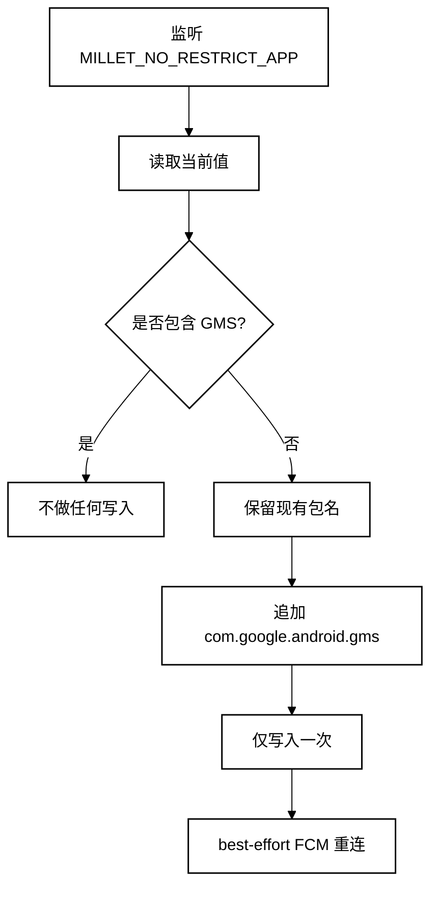

<p align="center">
  <a href="README.md">English</a> · <a href="README.zh-CN.md"><strong>简体中文</strong></a>
</p>

<p align="center">
  
</p>

# FCM Guard for HyperOS

**一个轻量、免 Root 的 HyperOS 3 后台守护工具，用于让 Google Play 服务持续保留在小米免限制名单中，从而提升 FCM 推送可靠性。**

**适用范围：** 中国大陆销售、运行 **HyperOS 3 中国版 ROM** 的 Xiaomi / Redmi / POCO 手机，且 Google Play 服务已经正常安装并可使用。

<p align="center">
  <a href="https://github.com/ReedGAOOO/FCMGuard-HyperOS/releases/latest/download/FCMGuard-HyperOS.apk"><strong>直接下载最新版 APK</strong></a>
  ·
  <a href="https://github.com/ReedGAOOO/FCMGuard-HyperOS/releases/latest">查看最新 Release</a>
</p>

## 亮点

- **免 Root / Shizuku** — 仅使用用户可手动授权的 **修改系统设置** 权限，不依赖 Root、持续 ADB、无障碍、VPN、悬浮窗或设备管理员。
- **对金融 App 更友好** — 整体保持低权限设计，避免引入更容易触发安全敏感 App 风控的高权限方案。
- **低后台耗电** — 主要采用精确事件监听，30 分钟兜底检查仅在进程内运行，不会主动唤醒休眠手机。
- **只在必要时重连** — 仅在真正执行白名单修复后，或用户手动点击时发送 FCM/MCS 重连请求。
- **常驻通知可选** — 前台模式使用可见但静音的通知渠道提升进程存活率，也可切换为静默纯后台模式。
- **FCM App 助手** — 扫描可能依赖 Firebase/GCM 的 App；当 HyperOS 允许读取厂商 AppOps 时，会只读显示自启动状态，并在用户从系统设置返回后自动复查。
- **原生深色模式** — 支持 跟随系统 / 浅色 / 深色，默认 **跟随系统**。
- **10 种主流语言** — 英语、简体中文、繁体中文、法语、日语、韩语、西班牙语、葡萄牙语、德语、俄语，接入 Android 原生应用语言机制。
- **小屏适配** — 响应式布局自动检查 320–480dp 宽度，包含 Xiaomi 17 级别的 393dp profile。

## 快速使用

1. 直接从 **GitHub Releases** 下载并安装最新版 APK。
2. 打开 FCM Guard，授予 **修改系统设置** 权限。
3. 点击一次 **立即修复**。
4. 开启 **自动保护**。
5. 在 HyperOS 中为 FCM Guard 开启 **自启动**，并将电池策略设为 **无限制**。
6. 如果最看重后台可靠性，建议保持 **常驻通知** 开启。如果 Android / HyperOS 禁用了 FCM Guard 通知，App 会引导进入系统通知设置，使前台通知真正可见。
7. 可选：使用 **FCM App 助手** 扫描可能依赖 FCM 的 App。若当前 HyperOS 允许读取自启动状态，列表会标记 已开启 / 部分开启 / 未开启 / 未知，并在你从 **在 HyperOS 中统一配置** 返回后自动重新检查；若 ROM 不允许读取，FCM Guard 会明确显示“未知 / 不可读取”，而不是猜测。
8. 可选：点击 **打开 FCM 诊断**，进入 Google Play 服务诊断界面，检查 `mtalk.google.com:5228` 连接状态。
9. 为减少金融 App 的兼容风险，除非确有需要，建议保持开发者选项 / USB 调试 / 无线调试关闭。

> FCM Guard 主要针对中国版 HyperOS 3：Google 服务本身可以正常使用，但 PowerKeeper / Greezer 仍可能在后台限制 GMS，造成 FCM 推送延迟或中断。

---

# 技术原理

## 核心机制

在受影响的 HyperOS 设备上，小米的 PowerKeeper / Greezer 可能重建私有系统设置：

```text
Settings.System.MILLET_NO_RESTRICT_APP
```

如果其中缺少 `com.google.android.gms`，Google Play 服务可能被当作普通后台进程处理，从而导致长期保持的 FCM/MCS 连接被中断。

FCM Guard 会读取当前逗号分隔列表，保留所有已有包名，仅在缺失时追加 `com.google.android.gms`。



## 为什么使用 `targetSdk 22`

FCM Guard 有意保持 `compileSdk 35` + `targetSdk 22`。现代 compile SDK 让项目继续使用当前 Android 构建工具，而旧 target 保留对 Xiaomi 厂商私有 `Settings.System` key 的兼容写入路径，因此可以仅依靠用户授予的 **修改系统设置** 权限完成修复，而不需要 Root / Shizuku。

## 低功耗设计

- 只精确监听 `MILLET_NO_RESTRICT_APP` 对应 URI。
- 设置变化后约 400 ms 防抖。
- 使用 30 分钟进程内兜底，而不是高频轮询。
- 不使用 `AlarmManager`、周期精确闹钟或 WakeLock 进行兜底检查。
- GMS 已存在时不执行重复写入。
- 只有真正修复成功或用户主动操作时才发送重连广播。

## 常驻通知

开启常驻通知后，`GuardService` 会作为前台服务运行。当前版本改为独立的 `IMPORTANCE_LOW` 静音通知渠道，因此通知会保持可见，但不会发声或振动。

由于项目为了 Xiaomi 私有设置写入而刻意保持 `targetSdk 22`，Android 13+ 的通知权限弹窗时机由系统控制。如果通知已经被系统关闭，FCM Guard 会直接引导进入本 App 的系统通知设置页面。

## FCM 诊断

**打开 FCM 诊断** 现在优先启动当前 Google Play 服务使用的 Activity：

```text
com.google.android.gms/com.google.android.gms.gcm.GcmDiagnostics
```

同时保留旧版 `GTalkServiceDiagnostics` 作为兼容 fallback，并会最后尝试在 Google Play 服务的可见 Activity 中寻找诊断入口。

## FCM App 助手

扫描器会检查标准 manifest 信号，例如：

```text
com.google.firebase.MESSAGING_EVENT
com.google.android.c2dm.intent.RECEIVE
```

匹配意味着该 App **很可能** 使用 FCM/GCM，但不代表它的每一条通知都一定来自 FCM。

对于检测到的 App，FCM Guard 会尝试**只读**查询 Xiaomi 自启动相关的厂商 AppOps（`10008` 与 `10053`）。如果系统允许可靠读取，界面会显示：

- **已开启** — 两个自启动 AppOps 都是 allow。
- **部分开启** — 一个 allow，另一个明确为 ignore。
- **未开启** — 两个都明确为 ignore。
- **未知** — HyperOS 阻止了查询、返回了无法安全解释的默认 / 厂商状态，或没有暴露可靠结果。

FCM Guard **不会把“未知”当成“未开启”**。如果所有检测到的 App 都只能得到未知状态，逐 App 列表会自动隐藏，只保留检测数量和 **在 HyperOS 中统一配置** 入口，避免展示没有实际帮助的伪状态。用户从 HyperOS 设置页返回后，如果扫描结果仍展开，状态会自动重新读取。

整个过程不会程序化修改任何其他 App 的自启动状态，也不会引入 Shizuku / Root / ADB 权限。

## 外观、语言与屏幕适配

- 跟随系统 / 浅色 / 深色三种外观模式。
- 10 种原生 App 语言：英语、简中、繁中、法语、日语、韩语、西班牙语、葡萄牙语、德语、俄语。
- compact 与较大宽度分别使用响应式资源参数。
- CI 自动检查 320、360、393、411、430、480dp 宽度，包括 Hero / Status overlap 与同心圆角几何关系。

## 权限与隐私

FCM Guard 使用 `WRITE_SETTINGS`、`RECEIVE_BOOT_COMPLETED`、前台服务 / 通知支持，以及针对 FCM/GCM handler、Google Play 服务和小米安全中心的窄范围 package visibility。

FCM Guard **不需要** Root、Shizuku、持续 ADB、无障碍、VPN、悬浮窗、设备管理员、账号读取或网络流量抓取。

## 局限性

本项目依赖 Xiaomi 当前 HyperOS 的具体实现。未来如果 PowerKeeper / Greezer、私有设置 key、App 管理页面或厂商 AppOps 行为发生变化，本方案可能需要同步调整。FCM 重连、FCM App 识别和自启动状态读取都属于 best-effort，因为 Android 没有向普通第三方 App 提供保证这些厂商私有行为的公开 API。

## 参考与致谢

PowerKeeper / Greezer 行为与 `MILLET_NO_RESTRICT_APP` 修复思路最初由 **HyperOS FCM Fix** 项目进行了系统性调查与公开记录：

- HyperOS FCM Fix（`dingwen07`）：https://github.com/dingwen07/hyperos-fcm-fix
- 技术调查文档：https://github.com/dingwen07/hyperos-fcm-fix/blob/main/docs/xiaomi-hyperos-gms-fcm-greezer-investigation.md

FCM Guard 是独立实现，设计重点是无需 Shizuku / Root、权限尽量少、事件驱动和更低待机后台活动。本仓库没有复制 HyperOS FCM Fix 的源代码。

## 构建

GitHub Actions 会自动检查响应式布局并构建签名后的 debug APK。push 到 `main` 时还会自动创建 / 更新对应版本的 GitHub Release；feature branch 可先进行构建验证，再合并发布。

手机用户建议直接使用固定最新版地址：

**https://github.com/ReedGAOOO/FCMGuard-HyperOS/releases/latest/download/FCMGuard-HyperOS.apk**

## License

MIT License — 见 [LICENSE](LICENSE)。
