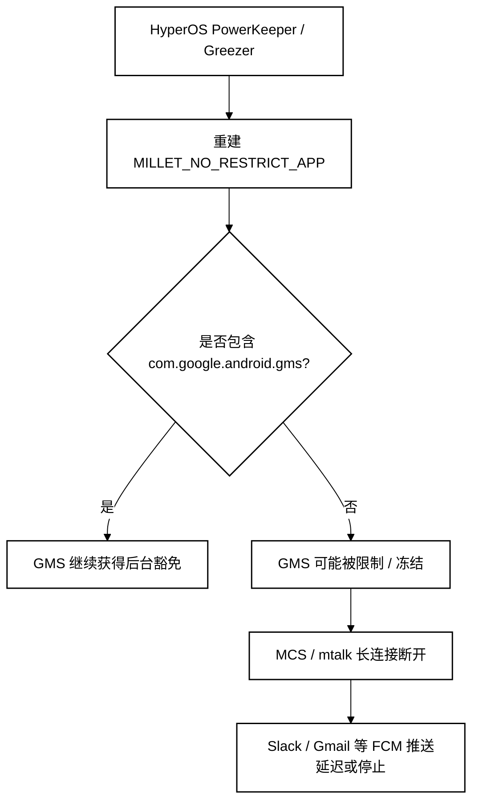
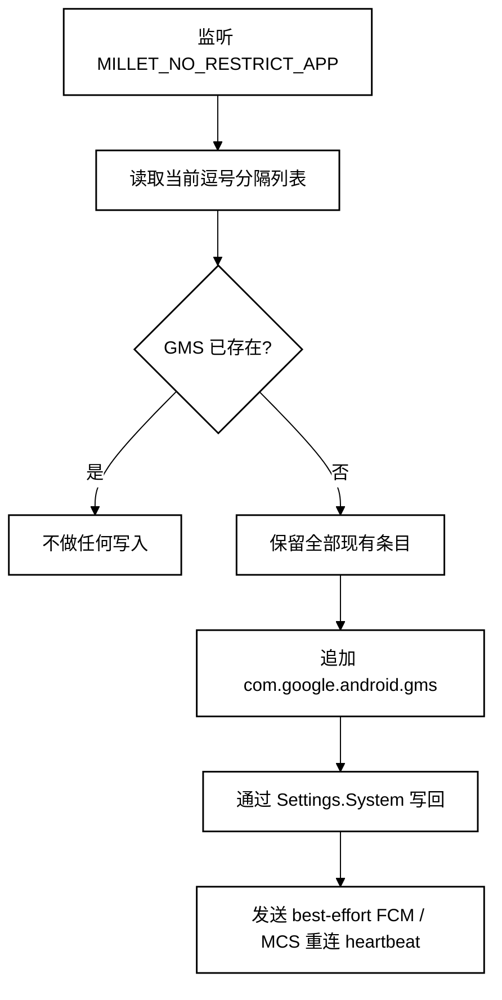
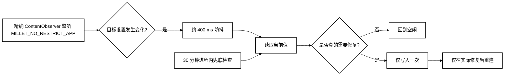
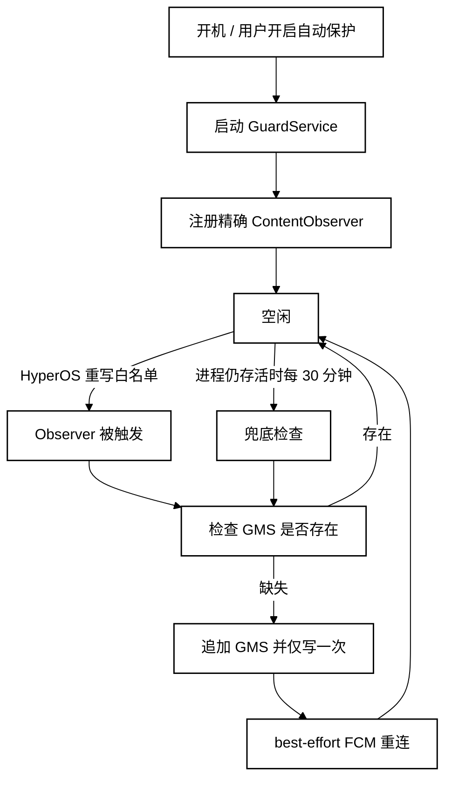

<p align="center">
  <a href="README.md">English</a> · <a href="README.zh-CN.md"><strong>简体中文</strong></a>
</p>

<p align="center">
  
</p>

# FCM Guard for HyperOS

**一个轻量、免 Root 的 HyperOS 3 后台守护工具，用于确保 Google Play 服务持续存在于系统免限制名单中，从而提升 FCM 推送可靠性。**

**适用范围：** 中国大陆销售、运行 **HyperOS 3 中国版 ROM** 的 Xiaomi / Redmi / POCO 手机，且 Google Play 服务已经正常安装并可使用。

## 亮点

- **免 Root / Shizuku** — 仅使用用户可手动授权的 **修改系统设置** 权限，不依赖 Root、ADB、无障碍、VPN、悬浮窗或设备管理员。
- **对金融 App 更友好** — 不依赖 Shizuku、持续 ADB / 调试或其他高权限免 Root 方案；我们的实测中，这类方案仍可能触发 DBS、Standard Chartered、BOC 等银行 App 的远程访问 / 安全风控，包括阻止登录、功能熔断或账号风险处置。
- **低后台耗电** — 主要采用事件触发，30 分钟兜底检查不会主动唤醒正在休眠的手机。
- **只在必要时重连** — 仅在真正执行修复后，或用户手动点击时发送 FCM/MCS heartbeat 重连请求。
- **常驻通知可选** — 可开启前台服务获得更高后台存活率，也可切换到静默纯后台模式保持通知栏整洁。
- **中英文界面** — 默认跟随系统语言，也可以手动切换 English / 简体中文。

## 快速使用

1. 从 **Actions → Build APK → `FCMGuard-debug-apk`** 下载并安装最新版 APK。
2. 打开 **FCM Guard**，授予 **修改系统设置** 权限。
3. 点击一次 **立即修复**。
4. 开启 **自动保护**。
5. 在 HyperOS 中为 FCM Guard 开启 **自启动**，并将电池策略设为 **无限制**。
6. 如果最看重后台可靠性，建议保持 **常驻通知** 开启；如果更在意通知栏整洁，可以关闭并使用静默后台模式。
7. 为减少银行 App 的兼容风险，除非确有需要，建议保持开发者选项 / USB 调试 / 无线调试关闭。

> FCM Guard 主要针对中国版 HyperOS 3：Google 服务本身可以正常使用，但 PowerKeeper / Greezer 仍可能在后台限制 GMS，造成 FCM 推送延迟或中断。国际版 ROM 通常不需要这套补丁。

---

# 技术原理

## 根因是什么

在部分 HyperOS 3 中国版设备上，小米的 PowerKeeper / Greezer 后台管理组件会重建一个私有系统设置：

```text
Settings.System.MILLET_NO_RESTRICT_APP
```

这是一个逗号分隔的“免限制 App”列表。如果其中没有 `com.google.android.gms`，Google Play 服务可能被当作普通后台进程处理。锁屏或长时间空闲后，HyperOS 可能冻结或限制 GMS，从而导致它与 Google 推送服务器之间长期保持的 FCM/MCS 连接断开。



## FCM Guard 做了什么

FCM Guard 不会用一份固定字符串覆盖小米自己的白名单，也不会接管 PowerKeeper。它只读取 HyperOS 当前生成的值，保留所有已有包名，并在必要时追加 Google Play 服务。



这种方式很重要：**白名单真正的所有者仍然是 PowerKeeper**。FCM Guard 只修补“GMS 被删掉”这一件事，而不是覆盖 HyperOS 当前维护的名单。

## 为什么必须使用 `targetSdk 22`

现代 Android 即使已经获得 **修改系统设置** 权限，也会限制普通 App 对非公开 `Settings.System` 项的写入。`MILLET_NO_RESTRICT_APP` 属于小米厂商私有 key，因此面向现代 target SDK 的 App 可能直接被 `SettingsProvider` 拒绝。

FCM Guard 有意保持：

```text
compileSdk 35
targetSdk 22
```

`compileSdk 35` 让项目仍可以使用现代 Android 构建工具；`targetSdk 22` 则保留写入这个 Xiaomi 私有设置所需的旧版兼容路径，因此不需要 Root、Shizuku 或 shell 权限。

旧 target SDK 在现代长屏设备上可能触发 letterbox，因此 Manifest 中同时显式开启了可调整大小和长屏支持。

## 低功耗后台设计

早期原型曾每 30 秒主动检查一次，而且会过于频繁地发送 reconnect 广播。当前版本已经改成**事件驱动优先**，健康状态下几乎一直处于空闲。



### 性能优化点

- **精确 URI 监听：** 只监听 `Settings.System.getUriFor(MILLET_NO_RESTRICT_APP)`，不再监听整个 System settings 表。
- **取消高频轮询：** 兜底检查从 30 秒一次降到 30 分钟一次。
- **不主动唤醒手机：** 兜底使用进程内 `Handler`，不使用 `AlarmManager`、WakeLock 或周期精确闹钟，所以不会主动把深度休眠设备叫醒。
- **避免重复写入：** 如果 GMS 已经存在，完全不碰系统设置。
- **避免重复重连：** 只有真正发生修复，或用户主动点击 **立即唤醒 FCM** 时才发送 heartbeat / reconnect 广播。
- **可选前台模式：** 常驻通知模式提高进程存活率；静默模式会移除通知，但 HyperOS 也更有机会终止后台 service。

## 运行时流程



## 权限与隐私

FCM Guard 只使用这套方案真正需要的 Android 能力：

- `WRITE_SETTINGS` — 由用户在 Android **修改系统设置** 页面手动授权。
- `RECEIVE_BOOT_COMPLETED` — 用户已开启自动保护时，在重启后恢复保护。
- `FOREGROUND_SERVICE` / 通知支持 — 仅在选择常驻通知模式时用于提高后台存活率。

FCM Guard **不需要** Root、Shizuku、持续 ADB、无障碍、VPN、悬浮窗、设备管理员、账号读取或网络流量抓取。

## 局限性

本项目依赖小米当前 HyperOS 的实现。如果未来 Xiaomi 改变 PowerKeeper / Greezer 的逻辑、白名单 key 名或针对 Google Play 服务的后台策略，本方案可能需要同步调整。

FCM reconnect 广播属于 best-effort 方案：Android 没有向第三方 App 提供一个可以保证“强制 FCM 立即重连”的公开 API。

## 参考与致谢

本项目的核心 HyperOS / FCM 机制，特别是 **PowerKeeper / Greezer 的行为** 与 `MILLET_NO_RESTRICT_APP` 的修复思路，最初由 **HyperOS FCM Fix** 项目进行了系统性调查与公开记录：

- **HyperOS FCM Fix**（`dingwen07`）：https://github.com/dingwen07/hyperos-fcm-fix
- 技术调查文档：https://github.com/dingwen07/hyperos-fcm-fix/blob/main/docs/xiaomi-hyperos-gms-fcm-greezer-investigation.md

FCM Guard 是独立实现，设计目标不同：不依赖 Shizuku / Root，尽量减少权限，以事件驱动方式监听系统设置，并进一步降低待机时的后台活动。本仓库没有复制 HyperOS FCM Fix 的源代码。

特别感谢原作者公开机制、调查记录与可复现结论，使得这个更轻量的实现成为可能。

## 构建

每次 push 到 `main` 后，GitHub Actions 都会自动构建签名后的 debug APK。

进入 **Actions → Build APK**，下载 `FCMGuard-debug-apk` artifact 即可。CI 会复用固定签名 key 缓存，因此同一仓库生成的后续版本可以直接覆盖更新，不会反复出现签名冲突。

## 免责声明

FCM Guard 会修改一个与 HyperOS 后台限制相关的厂商私有 Android system setting。项目按现状提供，若 Xiaomi 后续更改实现可能失效；请自行承担使用风险。

## License

MIT License — 见 [LICENSE](LICENSE)。
